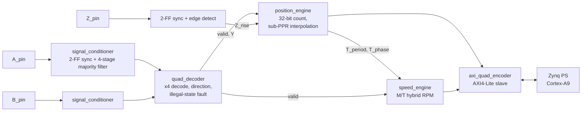

# Quadrature Encoder Interface on FPGA

A Verilog quadrature encoder interface for the **Digilent Arty Z7-10** (Zynq-7000, `xc7z010clg400-1`).
It turns raw A/B/Z encoder signals into position, interpolated angle, direction and speed,
and exposes the results to the ARM Cortex-A9 through an AXI4-Lite register map.

**Tools:** Xilinx Vivado 2026.1 · Icarus Verilog 12 · GTKWave

## Architecture



| Stage | Module | What it does |
|---|---|---|
| 1 | [`signal_conditioner.v`](src/signal_conditioner.v) | 2-FF synchroniser plus a 4-stage majority-vote filter. Rejects glitches shorter than 40 ns (6-cycle latency at 100 MHz) |
| 2 | [`quad_decoder.v`](src/quad_decoder.v) | x4 Gray-code decoding and direction output. Latches a fault on illegal A/B double transitions |
| 3 | [`position_engine.v`](src/position_engine.v) | 32-bit signed count, 0.1° angle output, and interpolation between pulses based on T_phase / T_period |
| 4 | [`speed_engine.v`](src/speed_engine.v) | M/T hybrid speed: T-method (period) is the primary path, F-method (pulse count) takes over at ~3000 RPM. Updates at 100 Hz |
| top | [`quad_encoder_top.v`](src/quad_encoder_top.v) | Connects stages 1–4 |
| 5 | [`axi_quad_encoder.v`](src/axi_quad_encoder.v) | AXI4-Lite slave wrapper for the PS |
| test | [`encoder_emulator.v`](src/encoder_emulator.v), [`quad_encoder_top_emu.v`](src/quad_encoder_top_emu.v) | On-chip A/B/Z generator (10–3000 RPM) for testing on the board without a motor |

Default configuration: 100 PPR (400 counts/rev), 100 MHz clock, 10 ms speed window.

### AXI4-Lite register map

| Offset | Name | Access | Contents |
|---|---|---|---|
| `0x00` | CTRL | W | bit0 `fault_clear` (self-clearing) |
| `0x04` | STATUS | R | bit0 fault, bit1 direction (1 = ACW), bit2 method (1 = F), bit3 stopped |
| `0x08` | COUNT | R | signed 32-bit position |
| `0x0C` | BASE_THETA | R | angle at last pulse, ×10 deg |
| `0x10` | THETA_INTERP | R | interpolated angle, ×10 deg |
| `0x14` | T_PERIOD | R | inter-pulse period, cycles |
| `0x18` | T_PHASE | R | cycles since last pulse |
| `0x1C` | RPM | R | speed, RPM ×10 |

## Repository layout

```
src/          RTL
sim/          Icarus Verilog testbenches
constraints/  Arty Z7-10 pin constraints (Pmod JA inputs, LD0/LD1)
project/      Vivado project (.xpr) and block design (encoder_block.bd + IP configs)
ip_repo/      axi_quad_encoder packaged as a Vivado IP (referenced by the .xpr)
docs/         encoder_log.csv (per-count error log from TC-9), waveform screenshots
```

## Running the simulations

Run these from the repository root. Icarus Verilog 12 or later is required.

```sh
# Stage 1-4 full pipeline (TC-3..TC-9). Writes quad_encoder.vcd and encoder_log.csv
iverilog -g2005 -o sim_stage4 src/signal_conditioner.v src/quad_decoder.v src/position_engine.v src/speed_engine.v src/quad_encoder_top.v sim/tb_quad_encoder.v
vvp sim_stage4

# Speed engine unit test
iverilog -g2005 -o sim_speed src/position_engine.v src/speed_engine.v sim/tb_speed_engine.v
vvp sim_speed

# TC-7 RPM accuracy sweep, 1-3000 RPM
iverilog -g2005 -o sim_tc7 src/position_engine.v src/speed_engine.v sim/tb_tc7_sweep.v
vvp sim_tc7

# Encoder emulator. Writes encoder_emulator.vcd
iverilog -g2005 -o sim_emu src/encoder_emulator.v sim/tb_encoder_emulator.v
vvp sim_emu

# Stage 5 AXI4-Lite wrapper
iverilog -g2005 -o sim_axi src/signal_conditioner.v src/quad_decoder.v src/position_engine.v src/speed_engine.v src/quad_encoder_top.v src/encoder_emulator.v src/quad_encoder_top_emu.v src/axi_quad_encoder.v sim/tb_axi_quad_encoder.v
vvp sim_axi
```

Waveforms can be viewed with `gtkwave quad_encoder.vcd`. The `.vcd` dumps are not committed because they are large (up to about 120 MB). Rerun a testbench to regenerate them.

## Results

| Testbench | Result |
|---|---|
| `tb_quad_encoder` | TC-3 (±200 counts → ±199 counted), TC-4 fault latch/clear, TC-5 Z-index reset, TC-6c/6d interpolation and stop detection: pass. TC-9 writes [`docs/encoder_log.csv`](docs/encoder_log.csv) |
| `tb_speed_engine` | Stopped, 20, 100 and 3000 RPM, and Z-index glitch rejection: all match expected values |
| `tb_tc7_sweep` | **16/16 points pass** the < 1 % target from 1 to 3000 RPM (worst case 0.033 % at 2999 RPM) |
| `tb_encoder_emulator` | TC-E1..E4 pass (CW/ACW sequence, divider timing, one Z per revolution) |
| `tb_axi_quad_encoder` | 4/7 pass. See the note below |

> **Note: AXI wrapper is in hardware-debug mode.** For board bring-up, `axi_quad_encoder.v`
> currently wraps `quad_encoder_top_emu`. That module drives the pipeline from the on-chip emulator (fixed 100 RPM, CW)
> instead of `A_pin`/`B_pin`, and LD0/LD1 are repurposed as debug indicators. `tb_axi_quad_encoder` drives the
> external pins, so its COUNT and fault checks fail in this build. Switching the instance back to
> `quad_encoder_top` restores the pin-driven design.

<!-- TODO: add GTKWave screenshots to docs/waveform_screenshots/ and link them here, e.g.
 -->

## Building the hardware

1. Open `project/encoder_FPGA.xpr` in Vivado 2026.1. The Arty Z7-10 board files must be installed.
2. The IP repository (`ip_repo/`) and constraints (`constraints/arty_z7_10_encoder.xdc`) are referenced relative to the project.
3. Generate the block design wrapper, then run synthesis, implementation and bitstream generation. Export the hardware (`.xsa`) if you need it for Vitis.

Encoder inputs are on Pmod JA: A = JA1 (Y18), B = JA2 (Y16), Z = JA3 (U18), fault_clear = JA4 (W18).

## License

[MIT](LICENSE)
